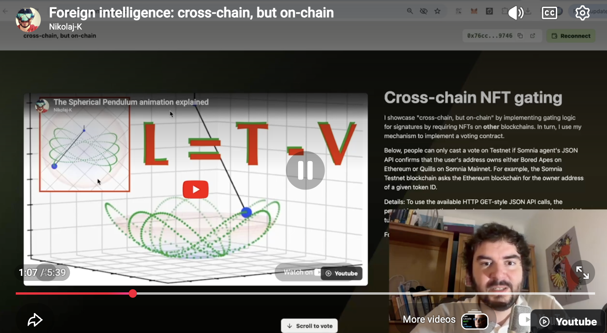

# Somnia NFT-Gated AI Vote

Public website: <https://somnia-agent.web.app>

Demo video: <https://youtu.be/5rDhxTbaQ10>

Somnia Shannon Testnet voting, gated by NFT ownership on a foreign blockchain.
Users choose ChatGPT, Claude, or DeepSeek; the vote contract asks a Somnia JSON
API agent to call a public ownership wrapper, then records a weighted vote only
when the callback confirms ownership.

## How To Try

1. Open the public website.
2. Connect an EVM wallet on Somnia Shannon Testnet.
3. Choose Quills Adventure or Bored Ape Yacht Club.
4. Enter `<TOKEN_ID>`, choose ChatGPT, Claude, or DeepSeek, then submit.
5. Wait for the Somnia callback to accept or reject the vote.

## Live Configuration

- Vote contract: `0x919eD02eba4772a72d6C75430026709009858754`
- Ownership wrapper example: <https://somnia-ownership-wrapper-735868209397.europe-west1.run.app/owns?collectionId=2&wallet=0x0000000000000000000000000000000000000000&tokenId=809>

| Collection | Ownership chain | Voting power |
| --- | --- | ---: |
| Quills Adventure | Somnia mainnet | 1 |
| Bored Ape Yacht Club | Ethereum mainnet | 2 |

## Architecture

Wallet -> Somnia vote contract -> Somnia JSON API agent -> Cloud Run ownership
wrapper -> ERC-721 `ownerOf(tokenId)` -> callback records weighted result.

Notes:

- Successful voting requires ownership of one of the supported NFTs. If you do
  not have one, redeploy the contract with your own collection configuration.
- The core contract includes debug-only demo functionality; remove the
  `debugOnly` / `TODO(DEMO-REMOVE)` paths before any production or trustless
  deployment.

Operational notes, deployment history, and video narration are indexed in
[`docs/README.md`](docs/README.md).

Do not commit private keys, seed phrases, local wallet config, `.env.local`,
`config.local.json`, generated ZIPs, dependencies, build artifacts, or Firebase
cache files.
